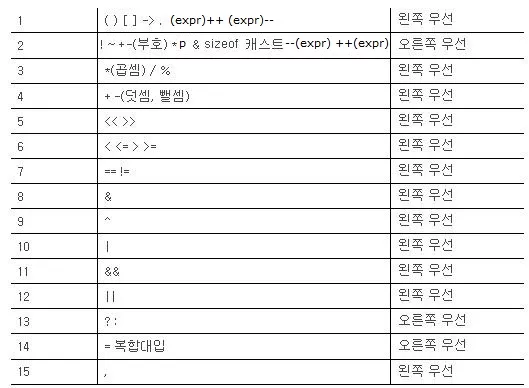

# 산술 연산자, 대입 연산자
> (+ - * / %) 를 산술 연산자 라 한다.
```c
#include <stdio.h>
int main(){
int a, b;
a = 10;
b = 3;
printf("a + b = %d \n", a+b);
printf("a = b = %d \n", a-b);
printf("a * b = %d \n", a*b);
printf("a / b = %d \n", a/b);
printf("a %% b = %d \n", a%b);
return 0;
}
```
>a + b = 13  
a - b = 7  
a * b = 30  
a / b = 3  
a % b = 1

+ int 는 정수만 받는놈.
+ %d만 쓰자.
# 대입 연산자
```c
#include <stdio.h>
int main() {
    int a = 3;
    a = a + 3;
    printf("a의 값은 %d \n", a);
    return 0;
}
```
>a의 값은 6
>>오른쪽값을 왼쪽에 대입.

## 더하기 1을 하는 방법.
```c
#include <stdio.h>
int main() {
    int a = 1, b = 1, c = 1, d = 1;

    a = a + 1;
    printf("a = %d", a);
    b += 1;
    printf("b = %d", b);
    ++c;//전위형
    printf("c = %d", c);
    d++;//후위형
    printf("d = %d", d);

    return 0;
}
```
>a = 2  
b = 2  
c = 2  
d = 2

## 전위형과 후위형의 차이.
```c
#include <stdio.h>
int main(){
    int a = 1;

    printf("++a = %d \n", ++a);

    a = 1;
    printf("a++ = %d" \n", a++):
    printf("a = %d \n", a);

    return 0;
}
```
>++a = 2  
a++ = 1  
a = 2

# 비트 연산자
| 종류 | 예시 | 적용 |
|---|:---:|---:|
| & | 1 & 1 = 1<br>1 & 0 = 0<br>0 & 1 = 0<br>0 & 0 = 1| 1010 & 0011 = 0010|
| shift + \\| 1 \ 1 = 1<br>1 \ 0 = 1<br>0 \ 1 = 1<br>0 \ 0 = 0 | 1101 \ 1000 = 1101|
| ^ | 1 ^ 1 = 0<br>1 ^ 0 = 1<br>0 ^ 1 = 1<br>0 ^ 0 = 0 | 1100 ^ 1010 = 0011 |
| ~ | ~1 = 0<br>~0 = 1 | ~1100 = 0011|
| << | 101011 = a | a << 1 = 01011**0**|
| >> | 1100010 = a<br>0011001 = b | a >> 3 = 1111100<br>b >> 3 = 0000011 |
```c
#include <stdio.h>
int main() {
    int a = 0xAF;   // 10101111
    int b = 0xB5;   // 10110101

    printf("%x \n", a & b);
               // a & b = 10100101
    printf("%x \n", a | b);
               // a | b = 10111111
    printf("%x \n", a ^ b);
               // a ^ b = 00011010
    printf("%x \n", ~a);
               // ~a = 1....1 01010000
    printf("%x \n", a << 2);
               // a << 2 = 1010111100
    printf("%x \n", b >> 3);
               // b >> 3 = 00010110
    
    return 0;
}
```
>a5  
bf  
1a  
ffffff50  
2bc  
16

>int는 4바이트, 32비트라서  
a = 1  
이라 하면 실제로 컴퓨터에는  
00000000 00000000 00000000 00000001  
이라 저장된다.  
따라서  
~a 는  
11111111 11111111 11111111 11111110  
이 되는 것이다.
# 복잡한 연산

>위의 그림 처럼 컴퓨터가 연산을 하는데<br>**순서**와 **방향**이 정해져있다.  
보통, 우선순위를 잘못 고려하여 발생하는  
오류들은 찾기가 매우 힘들기 때문에  
**에초애 햇갈릴 만한 부분은 (괄호)를 통해**  
**확실하게 하는 것이 좋다.**